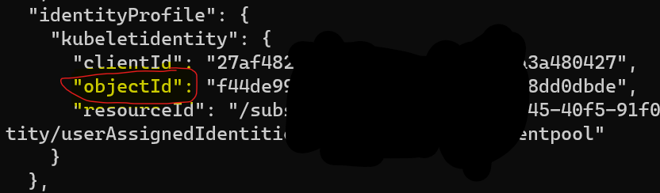
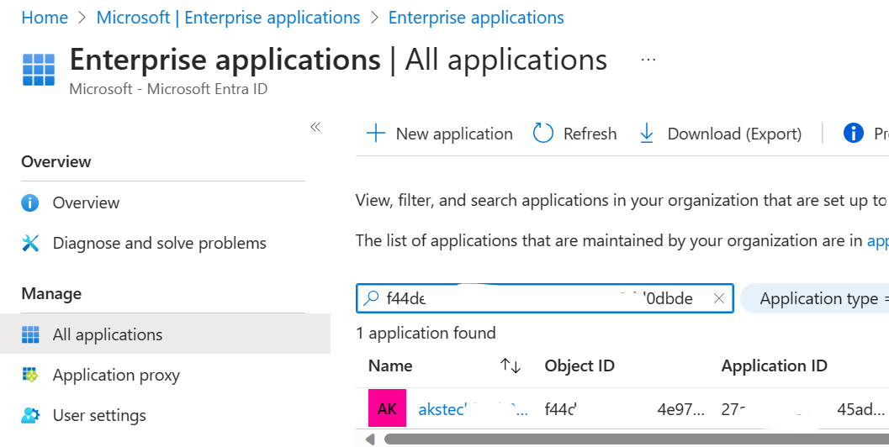

### How to deploy Azure AI containers in AKS

###### Prerequisites
- Azure subscription
- kubectl
- Language resource with F0 or Standard pricing tiers only.
- Azure AI services resource with the S0 pricing tier.

###### Process
- Login using az cli, create resource group, create ACR

```azurecli
az login
```

```azurecli
SUFFIX=techbash2023
```

```azurecli
LOCATION=eastus2
```

```azurecli
az group create --name rgai$SUFFIX --location $LOCATION
```

```azurecli
az cognitiveservices account create --name cgs$SUFFIX --resource-group rgai$SUFFIX --sku F0 --location $LOCATION --yes --kind TextAnalytics
```

```azurecli
az acr create --resource-group rgai$SUFFIX --name acr$SUFFIX --sku Basic
```

Get the **loginServer** value for later use.
```azurecli
loginServer=(az acr show --name acr$SUFFIX --query "loginServer" --output tsv)
```

Login to the ACR
```azurecli
az acr login --name acr$SUFFIX
```
Clone the frontend repo
```powershell
git clone https://github.com/Azure-Samples/cognitive-services-containers-samples
```

Navigate to the frontend folder \dotnet\Language\FrontendService and build the image
```powershell
docker build -t language-frontend -t $loginServer/language-frontend:v1 .
```

Push the image to the ACR
```powershell
docker push $loginServer/language-frontend:v1
```

Get the Language detector container image
```powershell
docker pull mcr.microsoft.com/azure-cognitive-services/textanalytics/language:latest
```

Tag the image for ACR
```powershell
docker tag mcr.microsoft.com/azure-cognitive-services/textanalytics/language:latest $loginServer/language:v1
```

Push the image to ACR
```powershell
docker push $loginServer/language:v1
```

Create AKS with system managed identity
```azurecli
az aks create --resource-group rgai$SUFFIX --name aks$SUFFIX --node-count 2 --enable-managed-identity --node-vm-size standard_d8a_v4
```

To figure out what SKUs to use make sure you satisfy the [minimum core-memory requirements](https://learn.microsoft.com/en-us/azure/ai-services/language-service/text-analytics-for-health/how-to/use-containers?tabs=language#host-computer-requirements-and-recommendations) for that container Open AI Service.

Get the managed identity of the AKS cluster
1. Get objectid from output
]
2. Use objectid in Entra portal to get managed identity

3. Note the app id

Get ACR id
```azurecli
ACRID=$(az acr show --name acr$SUFFIX --resource-group rgai$SUFFIX --query "id" --output tsv)
```

Give AKS app id Reader access to ACR
```azurecli
az role assignment create --assignee <app id> --role Reader --scope $ACRID
```

If you navigate to the IAM portal of ACR you should be able to see the AKS agentpool with Reader access.

Get AKS credentials for kubectl
```azurecli
az aks get-credentials --resource-group rgai$SUFFIX --name aks$SUFFIX
```

Run kubectl to ensure nodes are running
```powershell
kubectl get nodes
```

In the language.yml there are two sections. The file has a service section and a deployment section each for the two container types, the language-frontend website container and the language detection container.

Line 32 ```image``` property Image location for the frontend image in your Container Registry
<container-registry-name>.azurecr.io/language-frontend:v1

Line 78 ```image``` property	Image location for the language image in your Container Registry
<container-registry-name>.azurecr.io/language:v1

Line 91
apiKey property	Your Language service resource key
Line 92
billing property	The billing endpoint for your Language service resource.
https://westus.api.cognitive.microsoft.com/text/analytics/v2.1

deploy the container to aks
```powershell
kubectl apply -f language.yml
```


###### Best Practices
- Be mindful of the Azure AI container size (The one in this example is 5GB). Cache where possible
- Always check to make sure container fits your situation (disconnected for example)